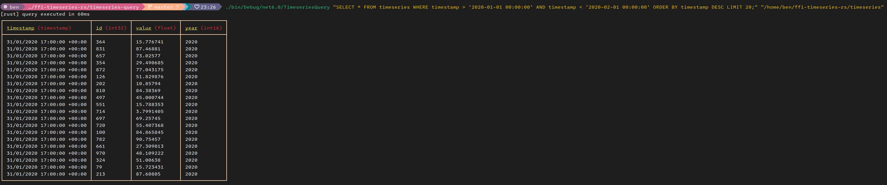

# Interacting with an Arrow Timeseries from C#

This repository shows an example of interacting with an Arrow timeseries from C#. The timeseries is generated by querying a Delta Table using DataFusion in Rust. The results of the query are returned to C# via Arrow's FFI interface. 

## Outstanding issues

* It may be possible to make the FFI interaction clearer - right now, in C# we create a pointer to a struct member because Apache.Arrow expects a pointer, but it's just converting that pointer into the representation we started with.
* On the Rust side, we hard-code a batch size of 4,000,000. This is the maximum number of results a query will return (because we only send the first batch back to C# via FFI). Possible improvements are using the FFI stream interface, or concatenating all batches into a single large record batch before invoking FFI.

## Example



## Usage

### Timeseries generation

Use `timeseries-populator-rs` to generate a Delta Table with around 20 years of 5 minute float values from 300 "sensors". Values are generated for 5 minute intervals between 08:00 and 17:00 each day.

You should change:

```rust
let table_uri = "/home/ben/ffi-timeseries-rs/timeseries";
```

To a suitable path. The directory doesn't need to exist yet.

Simply changing into the `timeseries-populator-rs` directory and running `cargo run` should generate a Delta Table.

### Native library compilation

Querying of the Delta Table and marshalling the results to Arrow is done in a Rust library. You must build the native library before running the dotnet code:

In `timeseries-rs/`:

```bash
cargo build --release
```

### Query application compilation

Once the native library has been compiled, compile the .NET query application:

In `timeseries-query/`:

```bash
dotnet build
```

Now copy the native library into the same directory as your compiled .NET application. In `timeseries-query/`:

```
cp ../timeseries-rs/target/release/libtimeseries_rs.so ./bin/Debug/net6.0/
```

### Running a query

> Queries with a large number of results may look like they're taking a long time to execute. It's likely that the query executed quickly, and C# is taking a long time to render the results in your console. The native library prints a line like: `[rust] query executed in ...ms` to show you how long Rust took to execute your query and marshal it as FFI-spec Arrow. Any time longer than this is C# rendering the Arrow to the console.

In `timeseries-query/`:

```bash
./bin/Debug/net6.0/TimeseriesQuery "SELECT * FROM timeseries WHERE timestamp > '2020-01-01 00:00:00' AND timestamp < '2020-02-01 00:00:00' ORDER BY timestamp DESC LIMIT 10;" "/path/to/delta/table"
```

> Replace `/path/to/delta/table` with the path you hard-coded into `timeseries-populator-rs` in step 1.
 